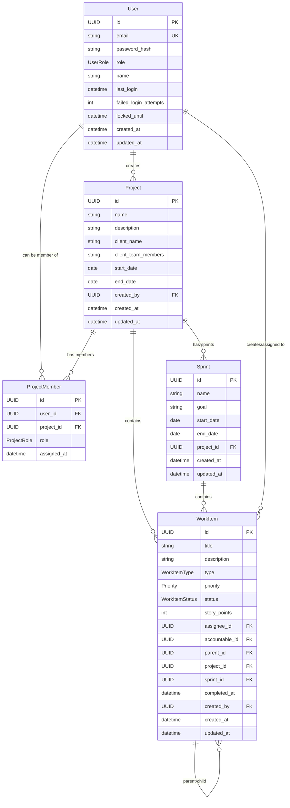

# Database Schema Documentation

## Overview

This document describes the database schema for the Project Management Tool MVP. The schema is designed to support hierarchical role-based access control, flexible project management, and comprehensive work item tracking.

## Technology Stack

- **Database**: PostgreSQL 14+
- **ORM**: Prisma
- **Migrations**: Prisma Migrate
- **Connection Pooling**: Prisma Connection Pool

## Core Design Principles

### 1. Security First

- UUID primary keys prevent enumeration attacks
- Password hashing with bcrypt (12+ salt rounds)
- Role-based access control at multiple levels
- Audit trails for security monitoring

### 2. Performance Optimized

- Strategic indexes on frequently queried columns
- Efficient relationship design
- Optimized for authentication patterns

### 3. Data Integrity

- Foreign key constraints ensure referential integrity
- Check constraints validate enum values
- Cascade deletion policies prevent orphaned data

### 4. Scalability

- Designed to handle 1000+ users initially
- Efficient query patterns for large datasets
- Proper indexing strategy for growth

## Entity Relationship Diagram



## Entity Definitions

### Users Table

The core authentication and authorization entity supporting hierarchical role-based access control.

| Column                  | Type         | Constraints      | Description                                         |
| ----------------------- | ------------ | ---------------- | --------------------------------------------------- |
| `id`                    | UUID         | PRIMARY KEY      | Unique identifier using UUID to prevent enumeration |
| `email`                 | VARCHAR(255) | UNIQUE, NOT NULL | User's email address for authentication             |
| `password_hash`         | VARCHAR(255) | NOT NULL         | Bcrypt hashed password (12+ salt rounds)            |
| `role`                  | UserRole     | NOT NULL         | System-level role (ROOT_ADMIN, ADMIN, EMPLOYEE)     |
| `name`                  | VARCHAR(255) | NOT NULL         | Display name for user identification                |
| `last_login`            | TIMESTAMPTZ  | NULL             | Last successful login timestamp                     |
| `failed_login_attempts` | INTEGER      | DEFAULT 0        | Counter for account lockout mechanism               |
| `locked_until`          | TIMESTAMPTZ  | NULL             | Account lockout expiration timestamp                |
| `created_at`            | TIMESTAMPTZ  | DEFAULT NOW()    | Account creation timestamp                          |
| `updated_at`            | TIMESTAMPTZ  | DEFAULT NOW()    | Last update timestamp                               |

#### Indexes

- `idx_users_email` - Fast authentication lookups
- `idx_users_role` - Role-based queries
- `idx_users_created_at` - User management and reporting

#### Security Features

- **Password Security**: Bcrypt with 12+ salt rounds
- **Account Lockout**: Configurable failed attempt threshold
- **Audit Trail**: Login tracking and attempt monitoring
- **Enumeration Protection**: UUID primary keys

### Projects Table

Organizes work and team collaboration with client information and timeline management.

| Column                | Type         | Constraints   | Description                      |
| --------------------- | ------------ | ------------- | -------------------------------- |
| `id`                  | UUID         | PRIMARY KEY   | Unique project identifier        |
| `name`                | VARCHAR(255) | NOT NULL      | Project display name             |
| `description`         | TEXT         | NULL          | Detailed project description     |
| `client_name`         | VARCHAR(255) | NULL          | Client organization name         |
| `client_team_members` | TEXT         | NULL          | Client team member information   |
| `start_date`          | DATE         | NOT NULL      | Project start date               |
| `end_date`            | DATE         | NOT NULL      | Expected project completion date |
| `created_by`          | UUID         | FOREIGN KEY   | Reference to creating user       |
| `created_at`          | TIMESTAMPTZ  | DEFAULT NOW() | Project creation timestamp       |
| `updated_at`          | TIMESTAMPTZ  | DEFAULT NOW() | Last update timestamp            |

#### Relationships

- **Creator**: Many-to-one with Users (created_by)
- **Members**: One-to-many with ProjectMembers
- **Work Items**: One-to-many with WorkItems
- **Sprints**: One-to-many with Sprints

### ProjectMembers Table

Junction table managing user-project relationships with role-based permissions.

| Column        | Type        | Constraints   | Description                  |
| ------------- | ----------- | ------------- | ---------------------------- |
| `id`          | UUID        | PRIMARY KEY   | Unique membership identifier |
| `user_id`     | UUID        | FOREIGN KEY   | Reference to user            |
| `project_id`  | UUID        | FOREIGN KEY   | Reference to project         |
| `role`        | ProjectRole | NOT NULL      | Project-specific role        |
| `assigned_at` | TIMESTAMPTZ | DEFAULT NOW() | Assignment timestamp         |

#### Constraints

- `unique_user_project` - Prevents duplicate user-project assignments
- Foreign key cascades on user/project deletion

#### Project Roles

- **OWNER**: Full project control and member management
- **MANAGER**: Work item management and task assignment
- **DEVELOPER**: Work item creation and status updates
- **TESTER**: Testing workflow and bug management

### WorkItems Table

Core entity for task management supporting hierarchical relationships and agile methodologies.

| Column           | Type           | Constraints    | Description                         |
| ---------------- | -------------- | -------------- | ----------------------------------- |
| `id`             | UUID           | PRIMARY KEY    | Unique work item identifier         |
| `title`          | VARCHAR(255)   | NOT NULL       | Work item title                     |
| `description`    | TEXT           | NULL           | Detailed description                |
| `type`           | WorkItemType   | NOT NULL       | Item type (EPIC, STORY, TASK, BUG)  |
| `priority`       | Priority       | DEFAULT NORMAL | Priority level                      |
| `status`         | WorkItemStatus | DEFAULT FUTURE | Current status                      |
| `story_points`   | INTEGER        | NULL           | Fibonacci scale estimation          |
| `assignee_id`    | UUID           | FOREIGN KEY    | Assigned team member                |
| `accountable_id` | UUID           | FOREIGN KEY    | Accountable team member             |
| `parent_id`      | UUID           | FOREIGN KEY    | Parent work item (self-referencing) |
| `project_id`     | UUID           | FOREIGN KEY    | Owning project                      |
| `sprint_id`      | UUID           | FOREIGN KEY    | Assigned sprint                     |
| `completed_at`   | TIMESTAMPTZ    | NULL           | Completion timestamp for burndown   |
| `created_by`     | UUID           | FOREIGN KEY    | Creating user                       |
| `created_at`     | TIMESTAMPTZ    | DEFAULT NOW()  | Creation timestamp                  |
| `updated_at`     | TIMESTAMPTZ    | DEFAULT NOW()  | Last update timestamp               |

#### Work Item Types

- **EPIC**: High-level feature or initiative
- **STORY**: User story or feature requirement
- **TASK**: Specific work item or development task
- **BUG**: Defect or issue to be resolved

#### Status Workflow

1. **FUTURE**: Not yet planned or scheduled
2. **IN_PLANNING**: Being planned, refined, or estimated
3. **IN_PROGRESS**: Actively being worked on
4. **IN_TESTING**: Under testing, review, or QA
5. **HOLD**: Temporarily blocked or paused
6. **IN_DISCUSSION**: Requires discussion or decision
7. **DONE**: Completed and ready for delivery

#### Priority Levels

- **IMMEDIATE**: Critical issues requiring immediate attention
- **HIGH**: Important work with high business value
- **NORMAL**: Standard priority work items
- **LOW**: Nice-to-have features or improvements

### Sprints Table

Supports agile iteration planning and progress tracking with burndown capabilities.

| Column       | Type         | Constraints   | Description                |
| ------------ | ------------ | ------------- | -------------------------- |
| `id`         | UUID         | PRIMARY KEY   | Unique sprint identifier   |
| `name`       | VARCHAR(255) | NOT NULL      | Sprint name                |
| `goal`       | TEXT         | NULL          | Sprint goal or description |
| `start_date` | DATE         | NOT NULL      | Sprint start date          |
| `end_date`   | DATE         | NOT NULL      | Sprint end date            |
| `project_id` | UUID         | FOREIGN KEY   | Owning project             |
| `created_at` | TIMESTAMPTZ  | DEFAULT NOW() | Creation timestamp         |
| `updated_at` | TIMESTAMPTZ  | DEFAULT NOW() | Last update timestamp      |

## Enumerations

### UserRole

- `ROOT_ADMIN`: Complete system access, can create other admins
- `ADMIN`: Can create projects and manage users
- `EMPLOYEE`: Base level user, requires project-level permissions

### ProjectRole

- `OWNER`: Full project control, can manage settings and members
- `MANAGER`: Can manage work items and assign tasks
- `DEVELOPER`: Can create/update work items and change status
- `TESTER`: Can update status, create bugs, manage testing workflows

### WorkItemType

- `EPIC`: High-level feature or initiative
- `STORY`: User story or feature requirement
- `TASK`: Specific work item or development task
- `BUG`: Defect or issue to be resolved

### Priority

- `IMMEDIATE`: Critical issues requiring immediate attention
- `HIGH`: Important work with high business value
- `NORMAL`: Standard priority work items
- `LOW`: Nice-to-have features or improvements

### WorkItemStatus

- `FUTURE`: Not yet planned or scheduled
- `IN_PLANNING`: Being planned, refined, or estimated
- `IN_PROGRESS`: Actively being worked on
- `IN_TESTING`: Under testing, review, or quality assurance
- `HOLD`: Temporarily blocked or paused
- `IN_DISCUSSION`: Requires discussion, decision, or clarification
- `DONE`: Completed and ready for delivery

## Permission Matrix

| Action               | Root Admin | Admin | Employee | Project Owner | Manager | Developer | Tester |
| -------------------- | ---------- | ----- | -------- | ------------- | ------- | --------- | ------ |
| Create Projects      | ✓          | ✓     | ✗        | ✗             | ✗       | ✗         | ✗      |
| Manage Root Users    | ✓          | ✓     | ✗        | ✗             | ✗       | ✗         | ✗      |
| Assign Project Roles | ✓          | ✓     | ✗        | ✓             | ✗       | ✗         | ✗      |
| Create Work Items    | ✓          | ✓     | ✗        | ✓             | ✓       | ✓         | ✓      |
| Update Work Status   | ✓          | ✓     | ✗        | ✓             | ✓       | ✓         | ✓      |
| Assign Story Points  | ✓          | ✓     | ✗        | ✓             | ✓       | ✓         | ✓      |
| Delete Work Items    | ✓          | ✓     | ✗        | ✓             | ✓       | ✗         | ✗      |
| Delete Projects      | ✓          | ✓     | ✗        | ✗             | ✗       | ✗         | ✗      |

## Database Indexes

### Performance Indexes

```sql
-- User authentication
CREATE INDEX idx_users_email ON users(email);
CREATE INDEX idx_users_role ON users(role);
CREATE INDEX idx_users_created_at ON users(created_at);

-- Project queries
CREATE INDEX idx_projects_created_by ON projects(created_by);
CREATE INDEX idx_projects_start_date ON projects(start_date);
CREATE INDEX idx_projects_end_date ON projects(end_date);

-- Project member lookups
CREATE INDEX idx_project_members_user_id ON project_members(user_id);
CREATE INDEX idx_project_members_project_id ON project_members(project_id);
CREATE INDEX idx_project_members_role ON project_members(role);

-- Work item queries
CREATE INDEX idx_work_items_project_id ON work_items(project_id);
CREATE INDEX idx_work_items_assignee_id ON work_items(assignee_id);
CREATE INDEX idx_work_items_status ON work_items(status);
CREATE INDEX idx_work_items_type ON work_items(type);
CREATE INDEX idx_work_items_priority ON work_items(priority);
CREATE INDEX idx_work_items_sprint_id ON work_items(sprint_id);
CREATE INDEX idx_work_items_parent_id ON work_items(parent_id);
CREATE INDEX idx_work_items_completed_at ON work_items(completed_at);

-- Sprint queries
CREATE INDEX idx_sprints_project_id ON sprints(project_id);
CREATE INDEX idx_sprints_start_date ON sprints(start_date);
CREATE INDEX idx_sprints_end_date ON sprints(end_date);
```

## Security Considerations

### Authentication Security

- **Password Hashing**: Bcrypt with minimum 12 salt rounds
- **Account Lockout**: Progressive lockout after failed attempts
- **Session Management**: Secure JWT tokens with expiration
- **Rate Limiting**: Protection against brute force attacks

### Authorization Security

- **Role-Based Access**: Hierarchical permission system
- **Project Isolation**: Users can only access assigned projects
- **Permission Enforcement**: Database and application level validation

### Data Protection

- **UUID Primary Keys**: Prevent enumeration attacks
- **Input Validation**: Zod schemas for all user inputs
- **SQL Injection Prevention**: Parameterized queries via Prisma
- **Audit Trails**: Comprehensive logging for security events

## Performance Characteristics

### Expected Query Performance

- **Authentication**: < 100ms (indexed email lookup)
- **Project Listing**: < 200ms (with member count)
- **Work Item Queries**: < 500ms (with filters and sorting)
- **Sprint Burndown**: < 300ms (aggregated calculations)

### Scalability Targets

- **Users**: 1,000+ concurrent users
- **Projects**: 100+ active projects
- **Work Items**: 10,000+ items per project
- **Concurrent Sessions**: 50+ simultaneous users

## Migration Strategy

### Development Setup

```bash
# Generate Prisma client
npm run db:generate

# Apply schema to database
npm run db:push

# Create initial migration
npm run db:migrate

# Seed initial data
npm run db:seed
```

### Production Deployment

```bash
# Generate production client
prisma generate

# Apply migrations
prisma migrate deploy

# Seed production data
npm run db:seed
```

## Backup and Recovery

### Backup Strategy

- **Daily automated backups** of production database
- **Point-in-time recovery** capability
- **Cross-region backup replication** for disaster recovery

### Recovery Procedures

- **Database restore** from backup files
- **Migration replay** for schema recovery
- **Data validation** post-recovery procedures

## Monitoring and Maintenance

### Performance Monitoring

- **Query performance** tracking via Prisma metrics
- **Connection pool** monitoring and optimization
- **Index usage** analysis and optimization

### Regular Maintenance

- **Database statistics** updates
- **Index rebuilding** as needed
- **Connection pool** tuning
- **Log rotation** and archival

## Future Considerations

### Planned Enhancements

- **Soft deletes** for data recovery
- **Audit logs** for compliance requirements
- **Read replicas** for scaling read operations
- **Caching layer** for frequently accessed data

### Schema Evolution

- **Migration strategies** for production updates
- **Backward compatibility** considerations
- **Data migration** procedures for major changes
- **Performance impact** assessment for schema changes
